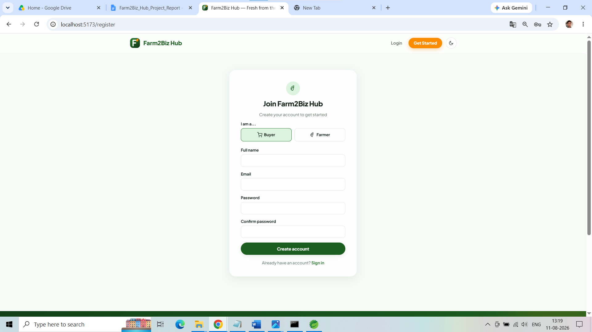
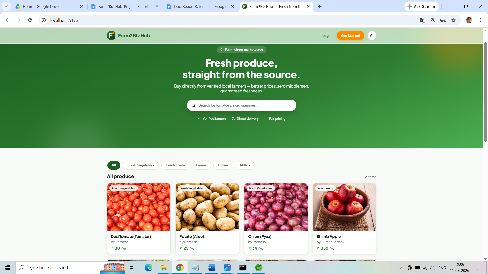
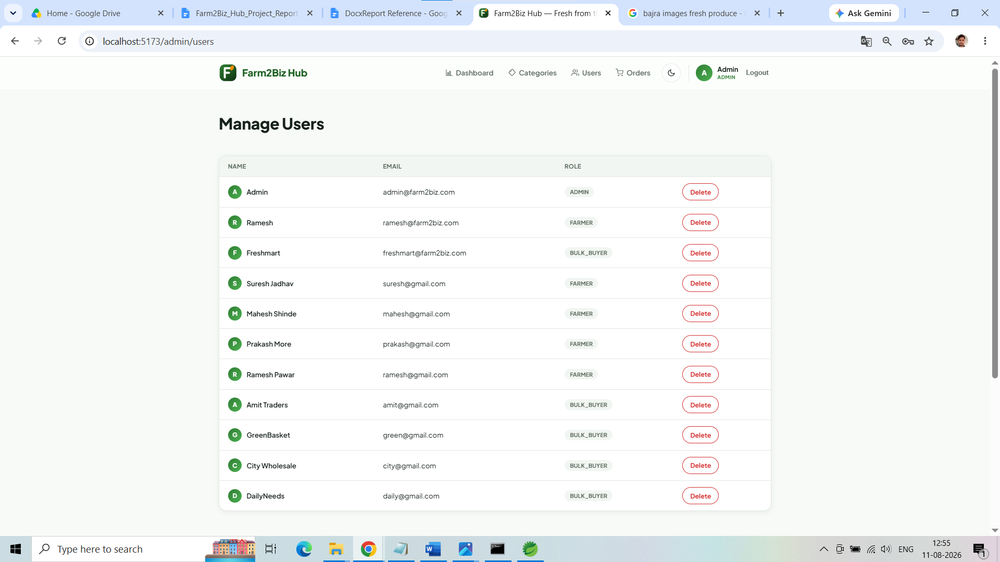
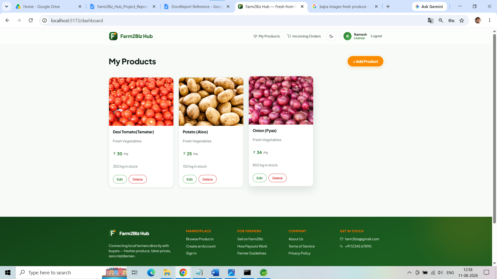
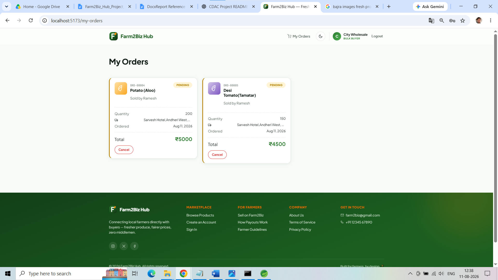

#  Farm2Biz Hub

### Connecting Farmers with Bulk Buyers — Digitally

**Farm2Biz Hub** is a full-stack agricultural marketplace that enables **farmers to list and manage products** while **bulk buyers can discover products, place orders, track purchases, and make payments** through a secure web application.

Built using **React.js + Spring Boot + MySQL**, the application follows a layered architecture with **JWT authentication, role-based authorization, REST APIs, JPA/Hibernate, validation, and centralized exception handling**.

### Full-Stack | Secure |  Agriculture |  B2B Marketplace

---

##  Key Features

|   Farmer              |   Bulk Buyer   |   Admin         |
| ---------------------- | --------------- | ----------------- |
| Manage products        | Browse products | Manage users      |
| Update inventory       | Place orders    | Manage categories |
| View incoming orders   | Track orders    | Monitor orders    |
| Accept / Reject orders | Make payments   | View reports      |

###   Security & Backend

* JWT-based authentication
* Spring Security
* Role-based authorization
* BCrypt password hashing
* Stateless authentication
* DTO-based API design
* Input validation
* Global exception handling
* CORS configuration

###   Application

* Product management
* Category management
* Order management
* Payment management
* User management
* Admin dashboard
* RESTful APIs
* Swagger/OpenAPI documentation

---

#   Tech Stack

### Frontend

* React.js
* React Router
* JavaScript
* HTML5
* CSS3
* Axios
* Vite
* Context API

### Backend

* Java 21
* Spring Boot 3.3.2
* Spring Web
* Spring Data JPA
* Hibernate
* Spring Security
* JWT
* Lombok
* Bean Validation
* Swagger / OpenAPI

### Database

* MySQL
* JPA / Hibernate ORM

### Development Tools

* Spring Tool Suite / Eclipse
* Visual Studio Code
* MySQL Workbench
* Postman
* Git
* GitHub

---

#   System Architecture


                     ┌─────────────────────┐
                     │   React Frontend    │
                     │                     │
                     │ Pages / Components  │
                     │ Context / Services  │
                     └──────────┬──────────┘
                                │
                         REST API + JWT
                                │
                                ▼
                 ┌──────────────────────────┐
                 │    Spring Boot Backend   │
                 │                          │
                 │      Controllers         │
                 │           ↓              │
                 │       Services           │
                 │           ↓              │
                 │      Repositories        │
                 └────────────┬─────────────┘
                              │
                              ▼
                    ┌──────────────────┐
                    │      MySQL       │
                    │                  │
                    │ Users            │
                    │ Products         │
                    │ Categories       │
                    │ Orders           │
                    │ Payments         │
                    └──────────────────┘


### Backend Architecture

```text
Controller
     ↓
Service
     ↓
Repository
     ↓
Database
```

Supporting layers:

```text
DTO
Validation
Exception Handling
Security
JWT Filter
```

---

#   Project Structure

```text
Farm2Biz-Hub/
│
├── frontend/
│   ├── src/
│   │   ├── components/
│   │   ├── context/
│   │   ├── hooks/
│   │   ├── pages/
│   │   ├── routes/
│   │   └── services/
│   └── package.json
│
├── backend/
│   ├── src/main/java/com/farm2biz/
│   │   ├── config/
│   │   ├── controller/
│   │   ├── custom_exceptions/
│   │   ├── dtos/
│   │   ├── entities/
│   │   ├── global_exceptions/
│   │   ├── repository/
│   │   ├── security/
│   │   ├── service/
│   │   └── serviceImpl/
│   │
│   ├── pom.xml
│   └── mvnw
│
├── screenshots/
│
└── README.md
```

---

#  User Roles

###   Farmer

* Register / Login
* Add products
* Update products
* Delete products
* Manage available quantity
* View incoming orders
* Accept / Reject orders

###   Bulk Buyer

* Register / Login
* Browse agricultural products
* View product details
* Place orders
* View orders
* Cancel eligible orders
* Make payments

###   Admin

* Manage users
* Manage categories
* Monitor orders
* View dashboard
* View reports

---

#   Authentication & Authorization

Farm2Biz Hub uses **Spring Security + JWT** for secure authentication.

```text
┌────────────┐
│   Login    │
└─────┬──────┘
      ↓
┌────────────┐
│  Validate  │
│ Credentials│
└─────┬──────┘
      ↓
┌────────────┐
│ Generate   │
│ JWT Token  │
└─────┬──────┘
      ↓
┌────────────┐
│ Frontend   │
│ stores JWT │
└─────┬──────┘
      ↓
Authorization: Bearer <JWT>
      ↓
┌────────────┐
│ JWT Filter │
└─────┬──────┘
      ↓
┌────────────┐
│ Protected  │
│ REST API   │
└────────────┘
```

Passwords are stored using **BCrypt hashing**.

---

#   Database Design

The application uses **MySQL + JPA/Hibernate**.

### Main Entities

```text
User
 │
 ├───────────────< Product >──────────── Category
 │
 └───────────────< Order >───────────── Product
                         │
                         └──────── Payment
```

### Main Tables

| Entity     | Purpose                            |
| ---------- | ---------------------------------- |
| `User`     | Stores application users and roles |
| `Product`  | Stores agricultural products       |
| `Category` | Stores product categories          |
| `Order`    | Stores buyer orders                |
| `Payment`  | Stores payment information         |

---

#   REST APIs

| Module            | Operations                          |
| ----------------- | ----------------------------------- |
|   Authentication | Register, Login                     |
|   Users          | Create, Read, Update, Delete        |
|   Products       | Create, Read, Update, Delete        |
|   Categories     | Create, Read, Update, Delete        |
|   Orders         | Place, View, Accept, Reject, Cancel |
|   Payments       | Create, View                        |
|   Reports        | Dashboard / Summary                 |

---

#   API Documentation

Swagger UI:

```text
http://localhost:8080/swagger-ui/index.html
```

OpenAPI specification:

```text
http://localhost:8080/v3/api-docs
```

### API Testing Flow

```text
Register
   ↓
Login
   ↓
Copy JWT
   ↓
Authorize Swagger
   ↓
Test Protected APIs
```

APIs can also be tested using **Postman**.

---
## 📸 Screenshots

### Registration



### Home Page



### Admin Dashboard


### Farmer Dashboard



### Bulk_Buyer Dashboard




#   Getting Started

## Prerequisites

Install:

* Java 21
* Node.js & npm
* MySQL
* Git
* Spring Tool Suite / Eclipse
* Visual Studio Code

---

##   Clone Repository

```bash
git clone <YOUR_REPOSITORY_URL>
cd Farm2Biz-Hub
```

---

##   Configure Backend

Navigate to:

```bash
cd backend
```

Configure your MySQL database credentials and JWT secret in the application configuration.

> ⚠️ Never commit real passwords, JWT secrets, API keys, or `.env` files to GitHub.

---

##   Run Backend

### Windows

```powershell
.\mvnw.cmd spring-boot:run
```

### Linux / macOS

```bash
./mvnw spring-boot:run
```

Backend:

```text
http://localhost:8080
```

---

##   Run Frontend

Open a new terminal:

```bash
cd frontend
npm install
npm run dev
```

Frontend:

```text
http://localhost:5173
```

---

#   Testing

The application can be tested using:

* Swagger UI
* Postman
* Browser
* Manual frontend testing

### Important Test Areas

* User registration
* Login authentication
* JWT authorization
* Role-based access
* Product CRUD
* Category CRUD
* Order lifecycle
* Payment processing
* Invalid input validation
* Exception handling
* Unauthorized API access

---

#   Security

Implemented security mechanisms:

*   JWT authentication
*   BCrypt password hashing
*   Role-based authorization
*   Protected REST endpoints
*   Stateless sessions
*   Request validation
*   Global exception handling
*   CORS configuration

---

#  Future Enhancements

*  Real payment gateway integration
*  Delivery & shipment tracking
*  Email / SMS notifications
*  Farmer-Buyer chat
*  Advanced search and filtering
*  Cloud deployment
*  Docker containerization
*  CI/CD pipeline
*  Real-time notifications
*  Advanced analytics

---

# Project Highlights

This project demonstrates practical implementation of:

```text
Java & OOP
     +
DSA Concepts
     +
DBMS / MySQL
     +
Spring Boot
     +
Spring Security / JWT
     +
REST APIs
     +
JPA / Hibernate
     +
React.js
     +
Git & GitHub
```

### Key Concepts Demonstrated

* Full-stack development
* Layered architecture
* RESTful API design
* CRUD operations
* Authentication & Authorization
* Database relationships
* ORM using JPA/Hibernate
* DTO pattern
* Validation
* Exception handling
* Role-based access control
* Frontend-backend integration
* Version control

---

#  Project Status

| Component                | Status      |
| ------------------------ | ----------- |
| React Frontend           | Completed |
| Spring Boot Backend      | Completed |
| MySQL Database           | Completed |
| JWT Authentication       | Completed |
| Role-Based Authorization | Completed |
| REST APIs                | Completed |
| Swagger Documentation    | Completed |
| Order Management         | Completed |
| Payment Module           | Completed |

---

#  Author

### **Amit Kumar Dubey**

   **CDAC PGCP-AC**

   **Farm2Biz Hub — Full-Stack Web Application**

---

###  If you found this project interesting, consider giving it a star!

**Built with Java  + Spring Boot  + React  + MySQL**

---

##  License

This project was developed as an **academic project**.
